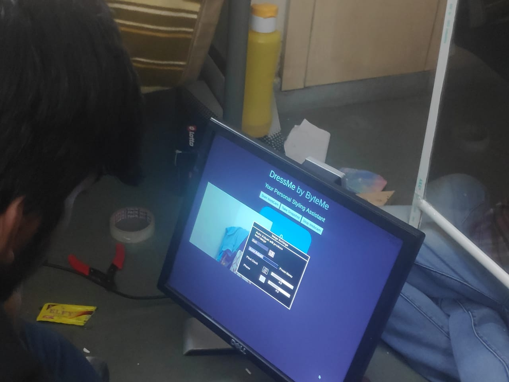
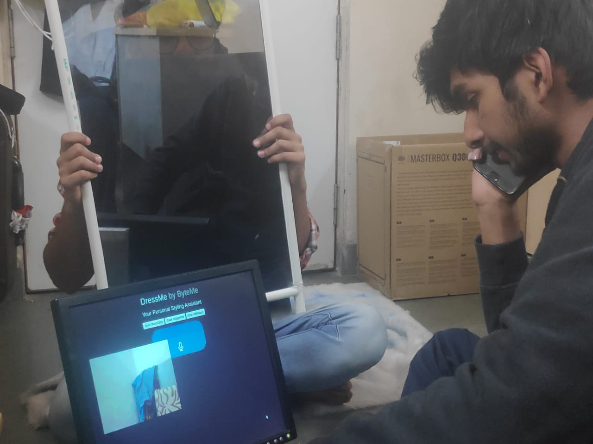

# Welcome to ByteMe's official website
​
You can see our github repositories by clicking on the top right corner. 
​

## DressMe
​
A smart mirror that recommends clothing for every occasion. It analyzes the clothes that you are wearing, and tells you if the color combination is an appropriate matches. Fret not the color suggestions are guided by a complete intensive research.
​

### Features

1. See recommended clothing for an occasion on the basis of past collection of photos.    
2. Checks how good the combination is.
3. The people you wore it with last time.
4. Add your new dresses to our database.
5. Save images and have them uploaded to googles API.
6. many more coming sooon.
P.S. We're accepting feature request and also GOOGLE CLASSROOM in next update.

### Pictures

  

​

